# **Healtho** 

**Healtho** is an app to track your daily water intake , sleep , workout exercises and boost your work efficiency.

## About

It uses Firebase Firestore its backend. It uses Firebase Authentication for email based auth and Google auth. 

### App Features

- **User Authentication** - Allowing users to login and register using Firebase Authentication 
- **Dashboard** - There are two dashboards for sleep and water. It shows the amount of water drank and hours slept and also logs for each.
- **Add Water** - Selecting water amount to add in daily water list.
- **Add Sleep** - Selecting number of hours to add in daily sleep list.
-  **Workout** - It shows the 7 minute workout screen, where the user has option to start 7 minute workout with animations and exercises information.
- **Statistics** - Shows statistics of water drank, hours slept and workout done within last week. 
- **Profile** - Shows user's profile.

## 📸 Screenshots

|||||
|:----------------------------------------:|:-----------------------------------------:|:-----------------------------------------: |:-----------------------------------------: |
| 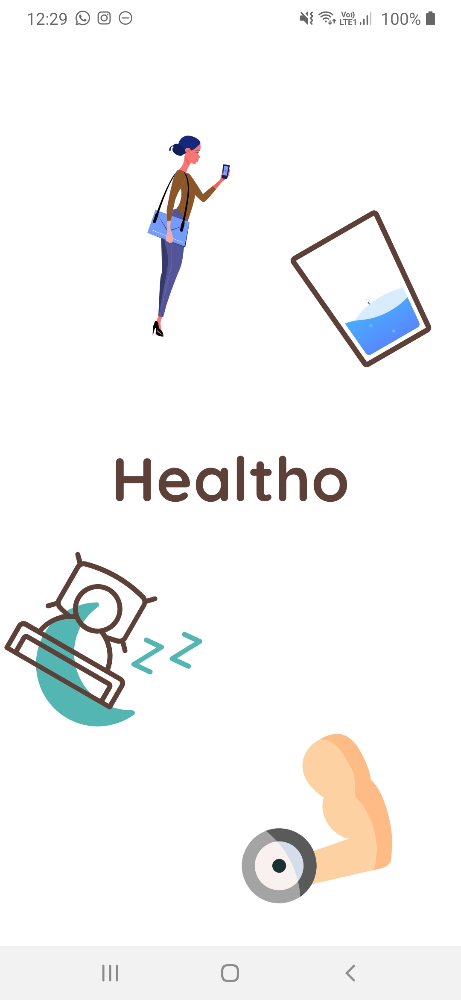 | 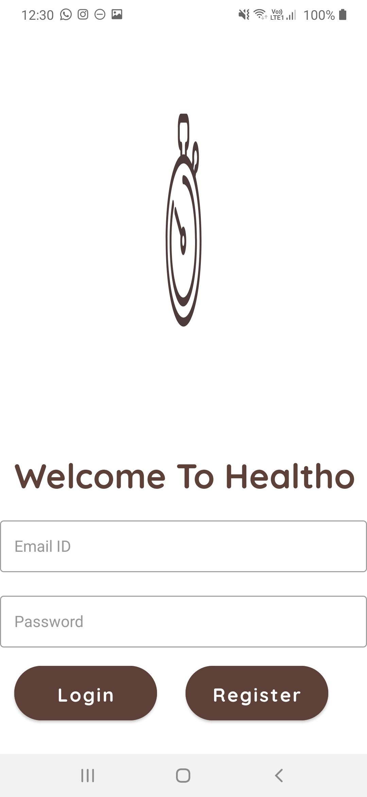 | 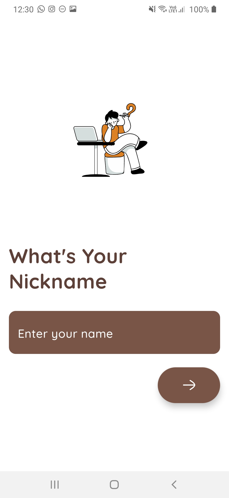 | 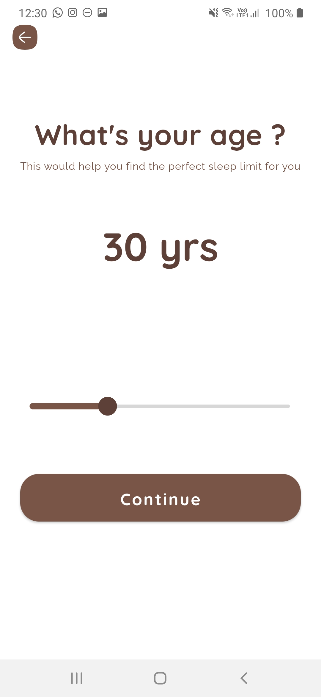 |
| 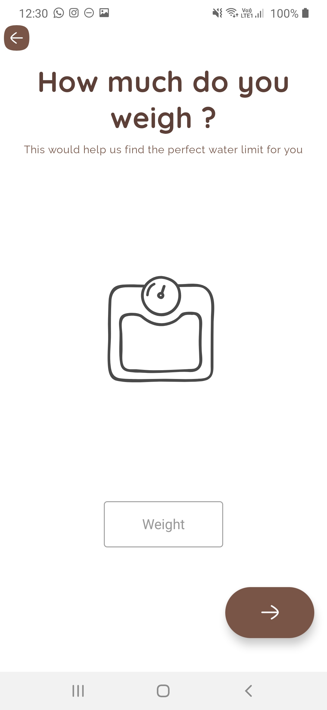 |  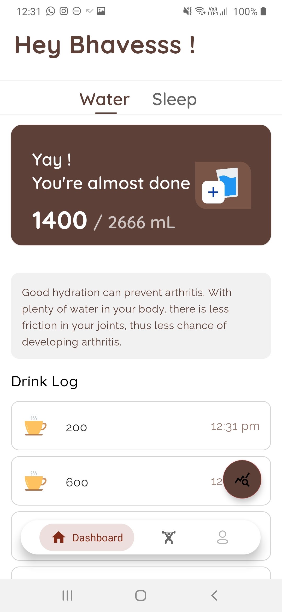  | 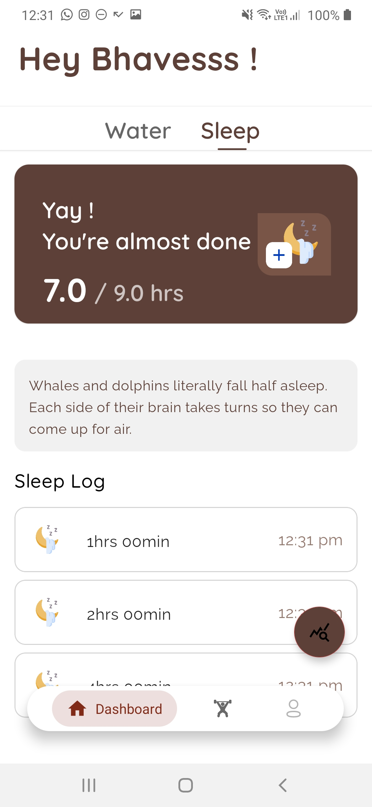 | 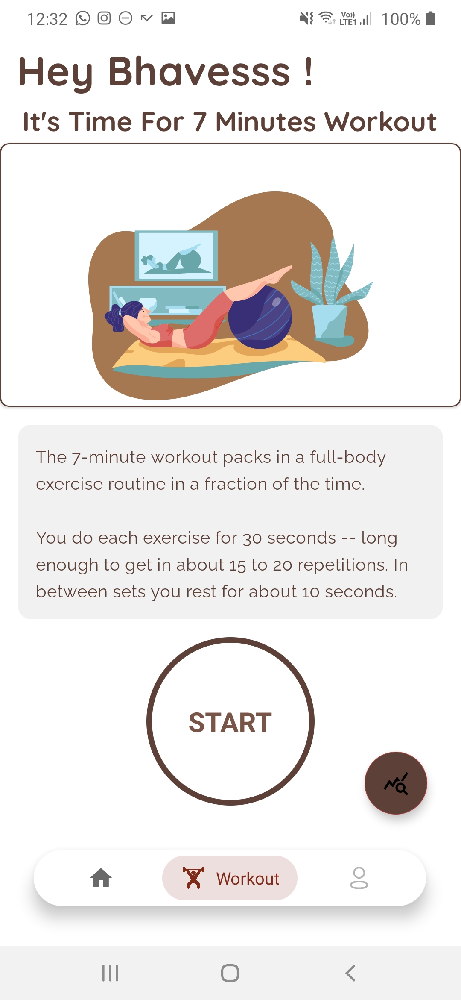    | 
| 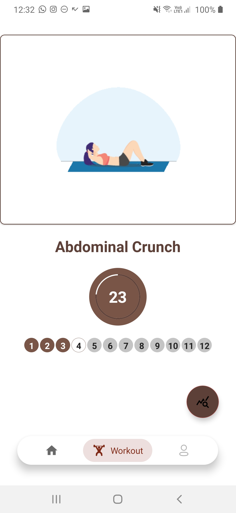 | 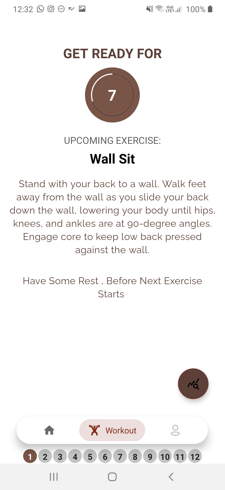    | 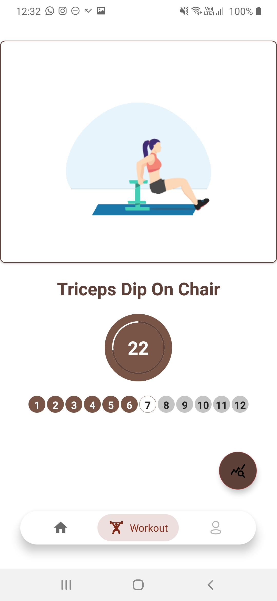      | 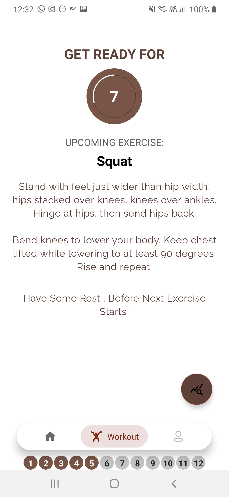 |
| 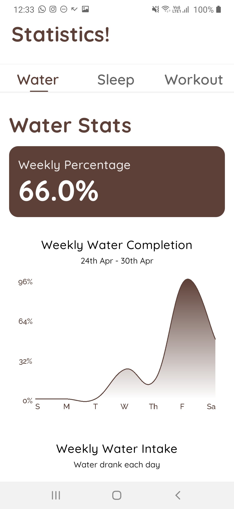  |    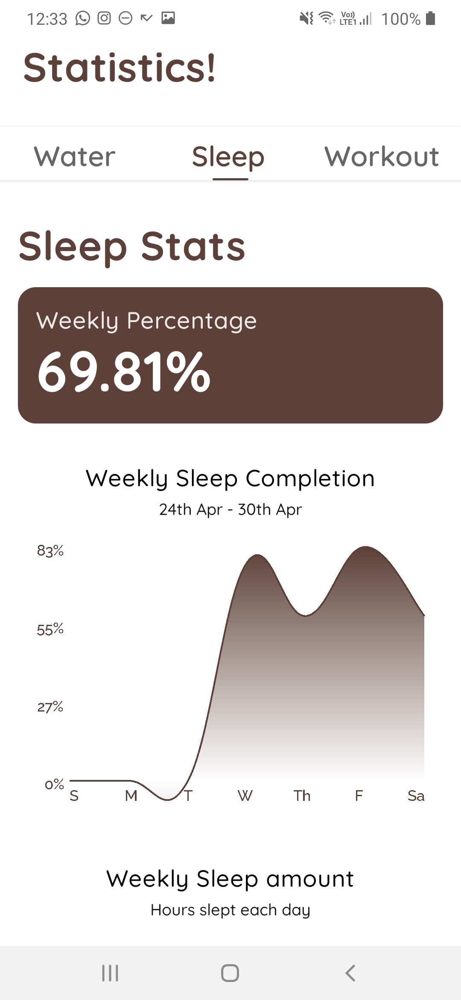    | 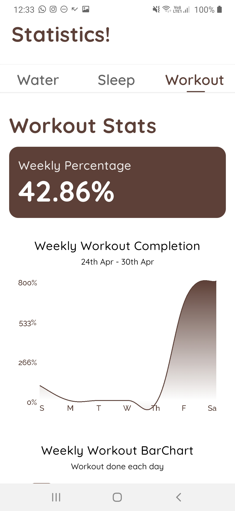        | 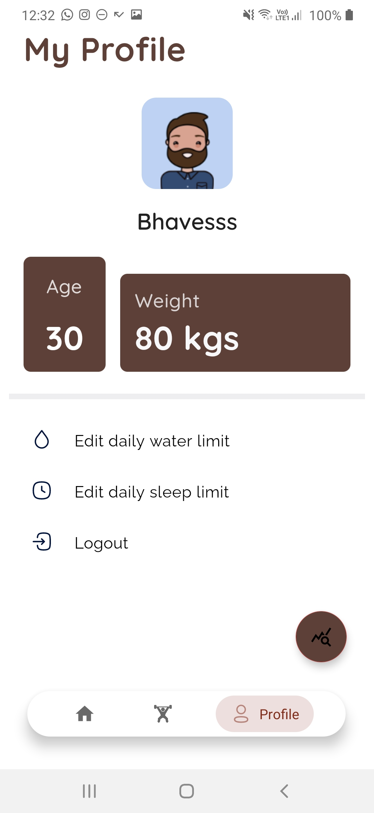 |

### Technical details 

- Healtho uses Firebase for user authentication, it supports email based authentication and Google authentication
- Healtho uses Firebase Firestore as it's primary database.
- Healtho has full offline support, it uses Android's ROOM database for caching all data offline.
- Healtho is made using Kotlin and following Modern Android Development practices.
- Healtho uses all Jetpack libraries and follows MVVM architecture.
- Healtho's code mostly follows all the good practices for Native Android Development.

## Built With 🛠
- [Kotlin](https://kotlinlang.org/) - First class and official programming language for Android development.
- [Coroutines](https://kotlinlang.org/docs/reference/coroutines-overview.html) - For asynchronous and more..
 - [StateFlow](https://developer.android.com/kotlin/flow/stateflow-and-sharedflow) - StateFlow is a state-holder observable flow that emits the current and new state updates to its collectors.
 - [SharedFlow](https://developer.android.com/kotlin/flow/stateflow-and-sharedflow) - A SharedFlow is a highly-configurable generalization of StateFlow.
- [Android Architecture Components](https://developer.android.com/topic/libraries/architecture) - Collection of libraries that help you design robust, testable, and maintainable apps.
  - [ViewModel](https://developer.android.com/topic/libraries/architecture/viewmodel) - Stores UI-related data that isn't destroyed on UI changes. 
  - [ViewBinding](https://developer.android.com/topic/libraries/view-binding) - Generates a binding class for each XML layout file present in that module and allows you to more easily write code that interacts with views.
  - [Room](https://developer.android.com/training/data-storage/room) - Room is an android library which is an ORM which wraps android's native SQLite database
  - [DataStore](https://developer.android.com/topic/libraries/architecture/datastore) - Jetpack DataStore is a data storage solution that allows you to store key-value pairs or typed objects with protocol buffers.
  - [Navigation](https://developer.android.com/guide/navigation) - Navigation refers to the interactions that allow users to navigate across, into, and back out from the different pieces of content within your app. Android Jetpack's Navigation component helps you implement navigation, from simple button clicks to more complex patterns, such as app bars and the navigation drawer. 
- [Dependency Injection](https://developer.android.com/training/dependency-injection) - 
  - [Hilt-Dagger](https://dagger.dev/hilt/) - Standard library to incorporate Dagger dependency injection into an Android application.
  - [Hilt-ViewModel](https://developer.android.com/training/dependency-injection/hilt-jetpack) - DI for injecting `ViewModel`.
- Backend
  - [Firebase](https://firebase.google.com) - Firebase Firestore - A NoSQL database to store all data
- [GSON](https://github.com/google/gson) - A modern JSON library for Kotlin and Java.
- [Timber](https://github.com/JakeWharton/timber) - A simple logging library for android.
- [GSON Converter](https://github.com/square/retrofit/tree/master/retrofit-converters/gson) - A Converter which uses Moshi for serialization to and from JSON.
- [Glide](https://github.com/bumptech/glide) - An image loading library for Android backed by Kotlin Coroutines.
- [Material Components for Android](https://github.com/material-components/material-components-android) - Modular and customizable Material Design UI components for Android.
- And Various Other Third Party Libraries for UI. 
## Architecture
This app uses [***MVVM (Model View View-Model)***] architecture.

## Video Functionality
  
